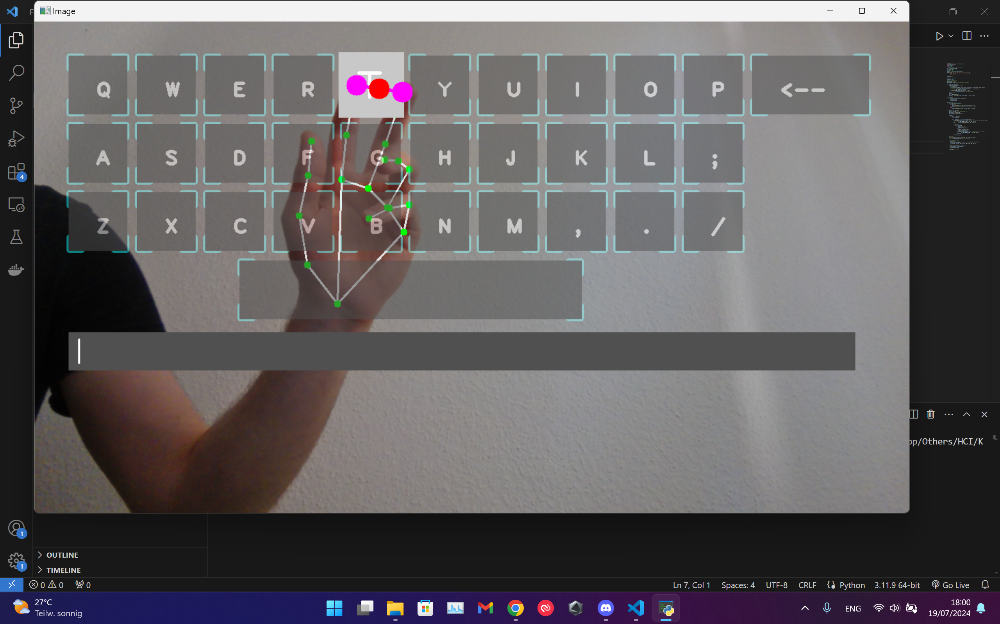
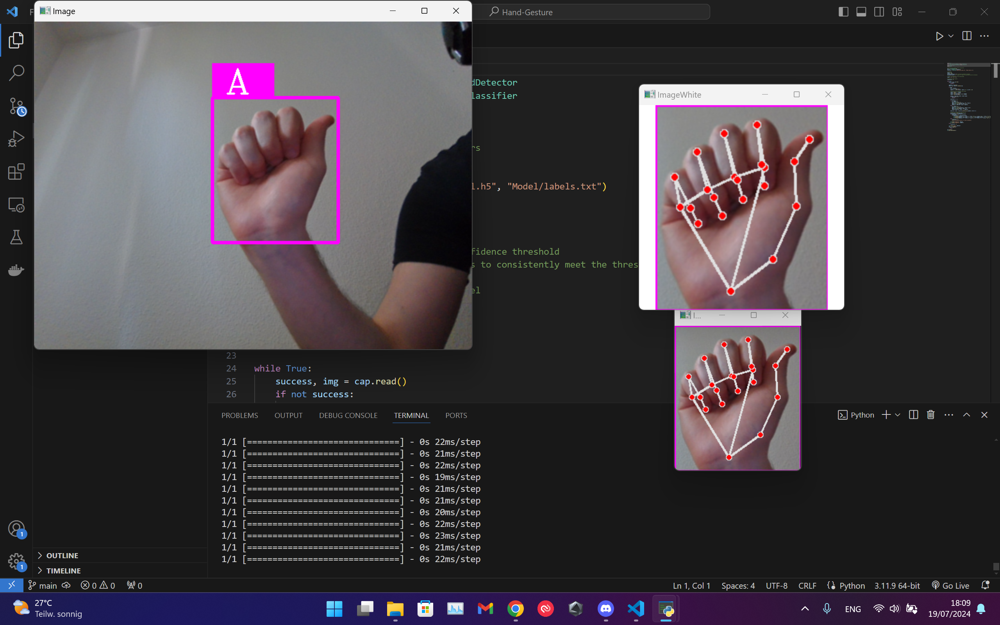

# Hand Gesture Recognition

## ✋ Description
This project investigates hand gesture recognition in the context of human-computer interaction through two prototypes: one for recognizing sign language and another for using a virtual keyboard. Both systems have been developed using modern image processing and machine learning techniques. The sign language recognition prototype translates hand gestures into text, while the virtual keyboard offers an innovative method for text input. The implementation includes hardware selection, data collection, and algorithmic processing.

  
  

## 🛠️ Technologies
- **Image Processing**: Techniques and algorithms used for hand gesture recognition.
- **Machine Learning**: Models and training processes for recognizing gestures.
- **Hardware**: Specifications for sensors and cameras used in the prototypes.
